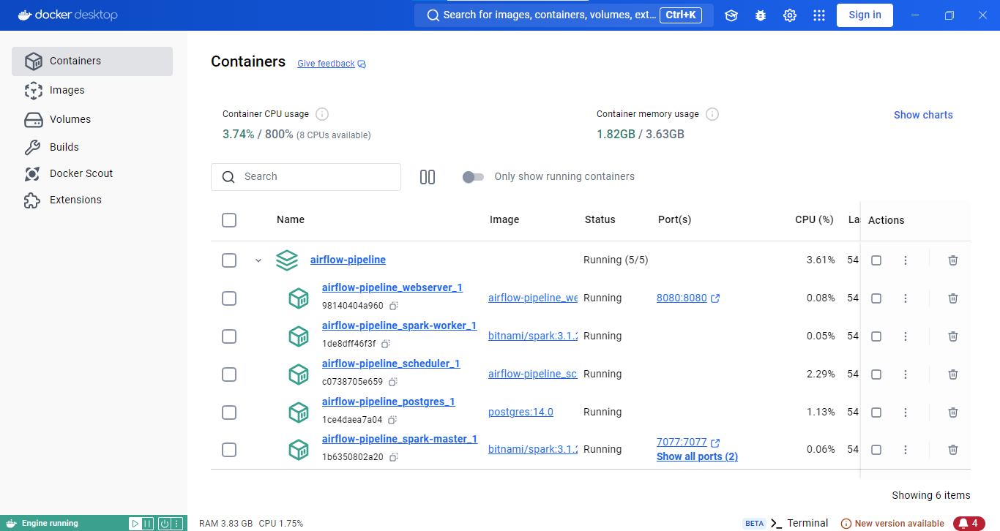
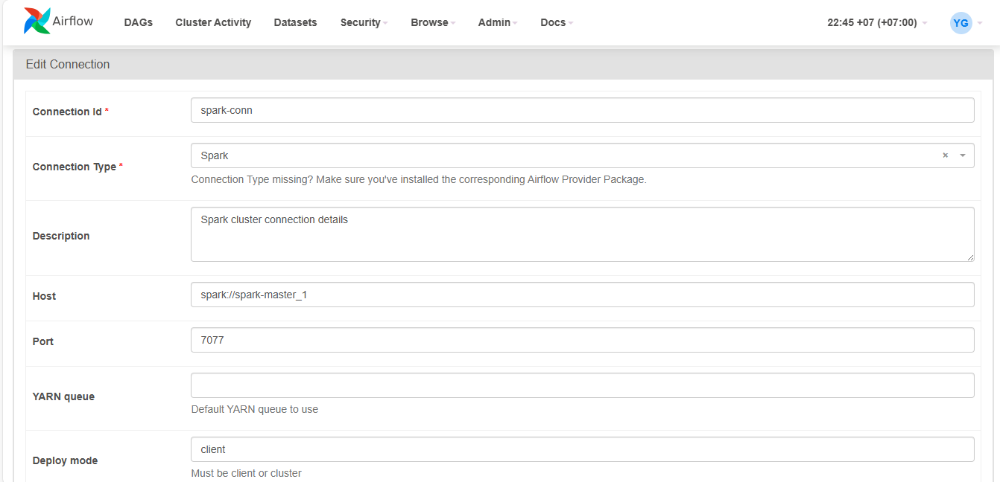
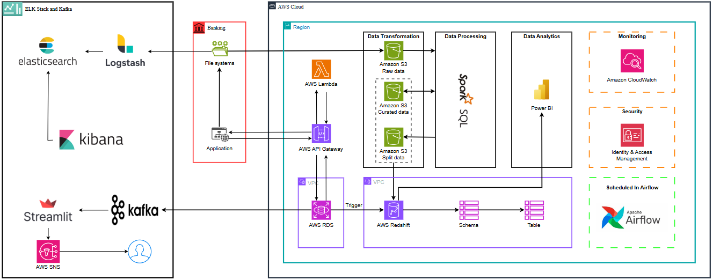
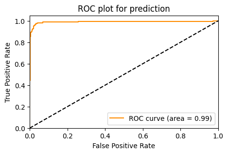
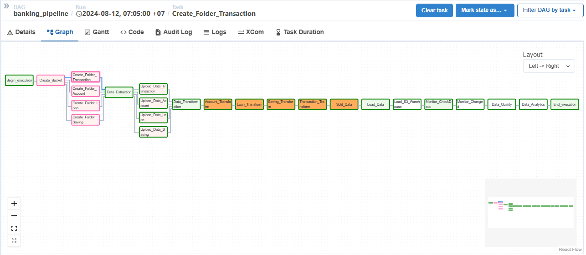
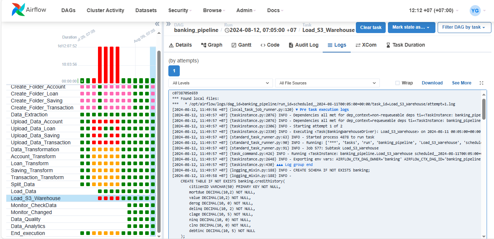
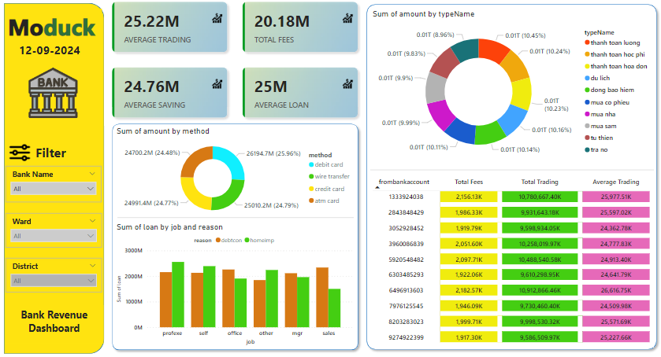

# Building-Applications-and-Data-Pipelines-for-Banks

### 🚀 1.INTRODUCTION
In this project, I built a website that serves some basic banking functions. My purpose of building this website is mainly to serve the purpose of collecting data to build a data pipeline. In this website, I have integrated some Machine Learning models to serve two problems: Credit Scoring and Fraudulent Transaction Prediction. Building a data pipeline helps me collect data from many sources and store it in a data warehouse to serve data analysis.

### 🧐 2.ABOUT DATA 
The HMEQ dataset reports characteristics and default information for 5,960 home equity loans. A home equity loan is a loan in which the borrower uses the equity value of the home as
collateral. The dataset has the following characteristics:

- **BAD**: 1 = the applicant is in default or seriously delinquent; 0 = the applicant has paid the loan
- **LOAN**: Amount of loan requested
- **MORTDUE**: Amount of outstanding debt on the current mortgage
- **VALUE**: Current value of the property.
- **REASON**: Reason for the loan DebtCon = debt consolidation; HomeImp = home improvement.
- **JOB**: job type, including the groups “Office”, “Sales”, “Mananger”, “Professional Executive”, “Self business” and other jobs.
- **YOJ**: Number of years at current job
- **DEROG**: Number of reported defaults.
- **DELINQ**: Number of delinquent credit lines
- **CLAGE**: Age of oldest credit line in months
- **NINQ**: Number of recent credit requests
- **CLNO**: Number of credit lines
- **DEBTINC**: Debt-to-income ratio

### 🛠️ 3.BUILD DOCKER AND CONNECTION

In the airflow-pipeline directory run: <strong>docker-compose up -d --build</strong>

To connect Apache Airlfow with Apache Spark, in the Airflow transaction select Admin, then select Connections and create a connection as shown below.

### 🔥 4.HOW TO RUN

To process data from the website, just activate it on the Apache Airflow interface.

To process data from logs collected from monitoring APIs, you need to install ELK Stack and run as follows:

- Move to elasticsearch directory and run: <strong>bin\elasticsearch.bat</strong>
- Move to kibana directory and run: <strong>bin\kibana.bat</strong>
- Move to logstash directory and run: <strong>bin/logstash -f /path/to/your/logstash.conf</strong>

To use kafka for real time fraud transaction alert run as follows:

- <strong>.\bin\windows\zookeeper-server-start.bat .\config\zookeeper.properties  <!-- Start the Zookeeper server --></strong>

- <strong>.\bin\windows\kafka-server-start.bat .\config\server.properties <!-- Start the Kafka server --></strong>

- <strong>.\bin\windows\kafka-topics.bat --create --bootstrap-server localhost:9092 --replication-factor 1 --partition 1 --topic “test” </strong>

- <strong>.\bin\windows\kafka-topics.bat --create --bootstrap-server localhost:9092 --replication-factor 1 --partition 1 --topic “test”</strong>

- <strong>.\bin\windows\kafka-console-producer.bat --broker-list localhost:9092 --topic “test”</strong>

- <strong>.\bin\windows\kafka-console-consumer.bat --topic “test” --bootstrap-server localhost:9092 --from-beginning</strong>

- <strong>streamlit run consumer.py</strong>

- <strong>python consumer.py</strong>

- <strong>python producer.py</strong>

### ✅ 5.Workflow

### 📝 6.RESULT

Model for Credit Scoring Problem

Data Pipeline

Run Dag

Data Analysis in Data Warehouse

### 🚨 7.Conclusion

The project is essentially complete, however, there are constraints in terms of resources and funding, which have led to some changes in the implementation strategy to optimize costs while still ensuring the effectiveness of the project.

